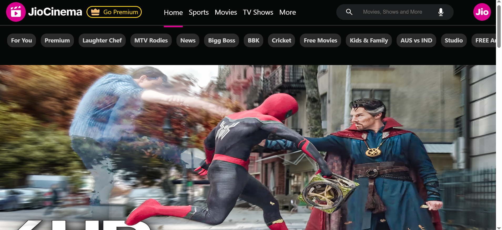

# JioCinema-UI-React
Jio-Cinema-UI- with-React
Developed Jio-Cinema UI with the help of React components, using vite bundler, React components, Hooks, Props, Routes etc.Jio 

A responsive movie streaming platform built with React, Module CSS, and TMDB API.

A modern movie streaming platform built with React.

## Features

- Responsive UI
- Authentication
- Movie Categories
- Search
- Watchlist

## Screenshots

### Home Page

